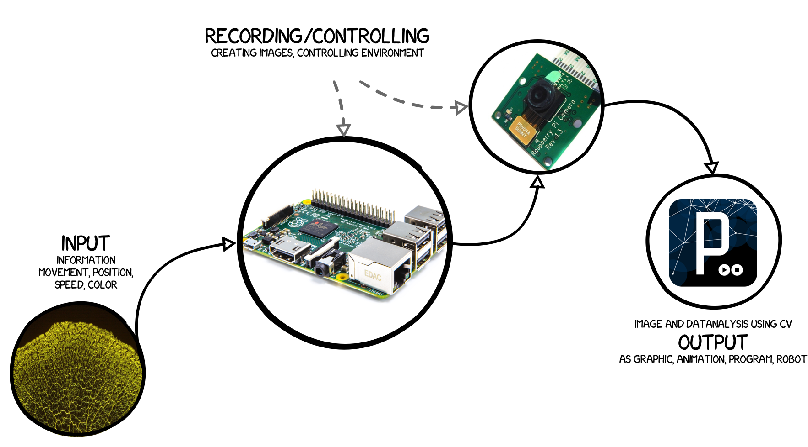
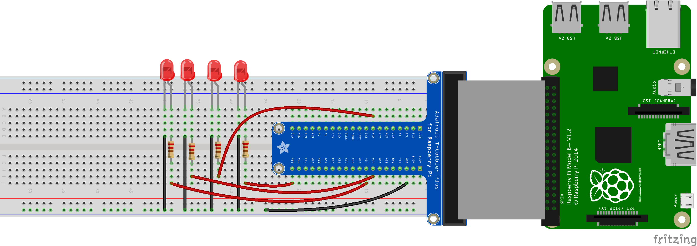

slime mold recording setup
==========================

A simple setup for constantly recording with the Raspberry Pi camera and some LEDs to light up the scene.  

  
##Prerequisites  

We asume you know how to setup your Camera Module and how to use the Terminal on the Raspberry Pi. 
See the wiring section for a fritzing sketch of the hardware setup.  

##Dependencies 

- rpi.gpio 
- picamera

##Install  

Download or clone the whole folder to your Raspberry Pi and place it somewhere where you like. For easy development there is a deployment.json for Atom or a sftp-config.json for Sublime Text  

Make sure you have all the libraries you need
    
    sudo apt-get update && sudo apt-get upgrade
    sudo apt-get install rpi.gpio python-picamera python3-picamera


##Usage  

Open the file `/python/camera-controller.py` and change the path to where you would like to store your images. It is around the top of the script. If the folder does not exist the script will create it.  

```python
    IMAGEFOLDER = "/home/pi/fhp/images/"
    IMAGENAME = "slime"
```

__If you want to use more then 4 LEDs you will have to edit the function `setup`.__  

Run the script from the Terminal:  

    sudo python /path/to/script/camera-controller.py

This should take a picture of whatever you have infront of the camera. Currently it takes pictures in the size 640 to 480. If you want higher resolution change the script in the main function.  

```python
    # 2592 x 1944
     cam.resolution = (640, 480)
```


To set this up for continous recording we need to use crontabs. They can be executed once per minute so if you need even more pictures you will need to find another reliable way. (See the todos). to use the GPIO pins we need to be root user. 

Setup a root crontab:  

    sudo crontab -e

Edit the following line to point to the right script path and add it to the crontab at the end-

    * * * * * /usr/bin/python /full/path/to/my/script/camera-controller.py

Save it and voilà. This should record every minute an image with a timestamp.  

##Wiring 

You will need:  

- 4 × 5mm LEDs  
- 4 × 220Ohm resistor  
- Pi Camera Module  
- Breadboard  
- (optional) Pi Cobbler
- Raspberry Pi  

Find the right pins for you it could be different for your Raspberry Pi depending on your model. I prototyped it on a Raspi B the image shows a B+. Hook up and enable your camera.  

Do the wiring like shown below.  

  

-----------

## Controling Arduino Boards

If you need to controll other hardware it is often easier to use an Arduino Board. The documentation you can find online is much better. The Raspberry Pi is a great computer. The Arduino board has it's focus more on the hardware. 

### Prerequisites & install
The easiest way is to send signals over a serial connection. For that you can just hook up the Arduino to one of the USB ports of the Pi. You actually can programm your Arduino right from the Pi. Just run the following command in the Terminal to install the Arduino IDE.

    sudo apt-get install arduino

This will install the Arduino IDE and create a folder called "sketchbook" under `/home/pi/sketchbook/`. Every *.ino sketch you place there will be available within the IDE.  

First install the needed libraries.

    sudo apt-get update && sudo apt-get upgrade
    sudo apt-get install python3-pip python-pip
    sudo pip install pyserial

### Usage
Now upload the sketch `/arduino/blink_over_serial/blink_over_serial.ino` to the board. Afterwards run the script `/python/arduino-controller.py`. The LED attached to pin 13 on the Arduino will blink until you end the script.  

### What happens?  

The python script will send a 0 and 1 with 1 second pause over the usb serial port. The arduino board is listening on the serial port and toggles the LED accordingly.  

### Possible issues:  

If the Arduino does not react attach the arduino to the other USB port. Whatch the output of the script. You need the pySerial libriary installed like mentioned above.  

##Todos  

- Make it possible to record images every 30 seconds or something else
- more code commenting  

##License
Copyright (c) 2015 Fabian "fabiantheblind" Moron Zirfas & FH-Potsdam  

Permission is hereby granted, free of charge, to any person obtaining a copy of this software and associated documentation files (the "Software"), to deal in the Software  without restriction, including without limitation the rights to use, copy, modify, merge, publish, distribute, sublicense, and/or sell copies of the Software, and to  permit persons to whom the Software is furnished to do so, subject to the following conditions:  
The above copyright notice and this permission notice shall be included in all copies or substantial portions of the Software.  
THE SOFTWARE IS PROVIDED "AS IS", WITHOUT WARRANTY OF ANY KIND, EXPRESS OR IMPLIED, INCLUDING BUT NOT LIMITED TO THE WARRANTIES OF MERCHANTABILITY, FITNESS FOR A  PARTICULAR PURPOSE AND NONINFRINGEMENT. IN NO EVENT SHALL THE AUTHORS OR COPYRIGHT HOLDERS BE LIABLE FOR ANY CLAIM, DAMAGES OR OTHER LIABILITY, WHETHER IN AN ACTION OF  CONTRACT, TORT OR OTHERWISE, ARISING FROM, OUT OF OR IN CONNECTION WITH THE SOFTWARE OR THE USE OR OTHER DEALINGS IN THE SOFTWARE.  

see also [http://www.opensource.org/licenses/mit-license.php](http://www.opensource.org/licenses/mit-license.php)

